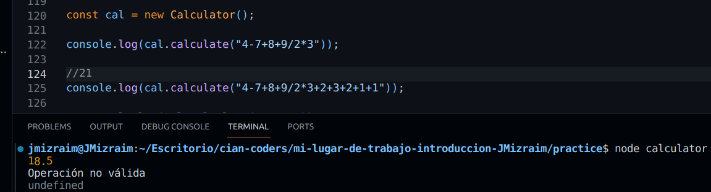

**Algoritmo de la Calculadora**

La clase Calculator proporciona un método para realizar cálculos aritméticos en una cadena de entrada que representa una expresión matemática.

El método `calculate` analiza una cadena de entrada que contiene una expresión matemática, evalúa la expresión de acuerdo con la jerarquía de operaciones.

### Componentes Clave

1. **Expresiones Regulares**: El algoritmo utiliza expresiones regulares para identificar operadores y operandos dentro de la cadena de entrada. Se definen dos expresiones regulares:

   - `#operatorRegEx`: Coincide con operadores matemáticos como `+`, `-`, `*`, `/` y `^`.
   - `#operandRegEx`: Coincide con operandos numéricos, incluidos enteros y decimales.

2. **Bucle Principal de Cálculo**:

   - El método itera a través de tres niveles de precedencia de operación: suma/resta, multiplicación/división y potencia (las raíces no son compatibles).
   - Dentro de cada iteración, identifica y evalúa las operaciones del nivel de precedencia actual hasta que no queden tales operaciones en la cadena de entrada.

3. **Construcción de Expresión Regular de Operación** (`#buildOpRegex`):

   - Este método construye una expresión regular basada en el nivel de precedencia especificado (0 para suma/resta, 1 para multiplicación/división y 2 para exponenciación).
   - La expresión regular se construye para coincidir con expresiones en el formato 'a x b', donde 'a' y 'b' son operandos y 'x' es un operador.

4. **isValid** (`#isValid`):

   - Este método verifica la validez de la expresión de entrada. Una expresión se considera válida si no supera los 20 caracteres y si tiene un operador más que operandos, excepto cuando comienza con un signo menos, en cuyo caso debe tener la misma cantidad de operadores que de operandos.

5. **doOperation** (`#doOperation`):
   - Ejecuta la operación aritmética especificada por el operador dado en los operandos proporcionados.

### Ejemplo de Uso

```javascript
const cal = new Calculator();

console.log(cal.calculate("4-7+8+9/2*3")); // Salida: 15.5
```

### Captura


