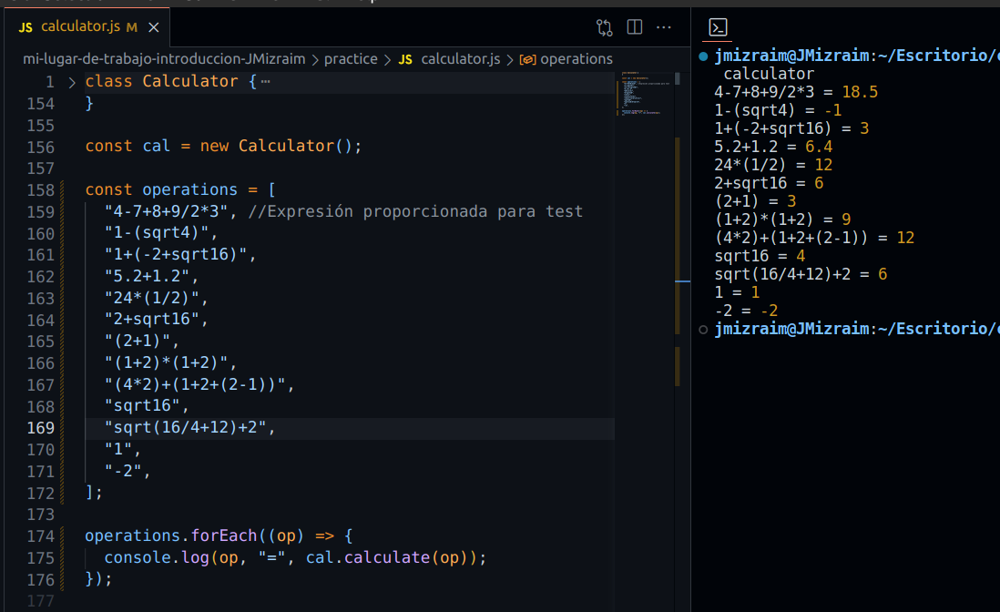

# Algoritmo de la Calculadora

La clase Calculator proporciona un método para realizar cálculos aritméticos en una cadena de entrada que representa una expresión matemática.

### Cumple con...

- ✅ Realiza las 4 operaciones básicas
- ✅ Validación de longitud máxima
- ✅ Respeta la jerarquía de operaciones
- ✅ Agrupamiento+
- ✅ Potencía y raíz cuadrada+

### Componentes Clave

1.  **Expresiones Regulares**: El algoritmo utiliza expresiones regulares para hacer que funciones. Se definen tres expresiones regulares:

    - `#operatorRegEx`: Coincide con operadores matemáticos como `+`, `-`, `*`, `/` y `^`.
    - `#operandRegEx`: Coincide con operandos numéricos, incluidos enteros y decimales.
    - `#parenthesisRegEx`: Esta expresión regular coincide con una expresión matemática que no incluye operaciones anidadas entre paréntesis.

2.  **Método Profundo de Cálculo (`#deepCalculation`)**:

    - El método `#deepCalculation` se encarga de realizar cálculos en una expresión matemática dada, que puede contener múltiples niveles de jerarquía de operaciones.

    #### Funcionamiento

    1. Primero, verifica si la expresión de entrada es válida utilizando el método `#isValid`.
    2. Luego, convierte todas las raíces cuadradas ("sqrt") en su equivalente utilizando potencias mediante el método `#convertSqrtToPower`.
    3. Itera sobre los diferentes niveles de jerarquía de las operaciones (de mayor a menor).
    4. Para cada nivel de jerarquía, busca y realiza las operaciones correspondientes en la expresión.
    5. Reemplaza las operaciones realizadas con su resultado en la expresión.
    6. Retorna el resultado final de la expresión.

3.  **Método de Cálculo (`#calculate`)**:

    - Este el método principal. Es público y maneja expresiones matemáticas con paréntesis anidados, facilitando el cálculo de expresiones complejas.

    #### Funcionamiento

    1. Verifica si la expresión de entrada tiene operaciones anidadas utilizando el método `#hasNestedOperation`.
    2. Si no hay operaciones anidadas, llama al método `#deepCalculation` para calcular la expresión directamente.
    3. Si hay operaciones anidadas, identifica la operación dentro de los paréntesis y calcula recursivamente esa operación utilizando el método `calculate`.
    4. Reemplaza la operación anidada con su resultado correspondiente y vuelve a llamar a `calculate` para resolver la expresión modificada.
    5. Retorna el resultado final de la expresión.

4.  **Construcción de Expresión Regular de Operación** (`#buildOpRegex`):

    - Este método construye una expresión regular basada en el nivel de precedencia especificado (0 para suma/resta, 1 para multiplicación/división y 2 para potencias).
    - La expresión regular se construye para coincidir con expresiones en el formato 'a x b', donde 'a' y 'b' son operandos y 'x' es un operador.

5.  **¿Es válido?** (`#isValid`):

    - Este método verifica la validez de la expresión de entrada (únicamente se contempló las validaciones más importantes).

      1. Si la cadena de entrada está vacía, la función devuelve false.
      2. Si la cadena de entrada es un número (único), la función devuelve true.
      3. Si la longitud de la cadena de entrada supera los 20 caracteres (requerimiento), la función devuelve false.
      4. Si la cadena de entrada comienza con "sqrt" y no contiene otros operadores (es decir, sqrt es la única operación), la función devuelve true.
      5. Si la cadena de entrada cumple con las reglas de operadores y operandos, la función devuelve true. Estas reglas son:
         - (startWithMinus = true), debe tener la misma cantidad de operadores que de operandos.
         - Si la expresión no comienza con un signo menos (startWithMinus = false), debe tener un operador más que operandos.

6.  **Hacer la operación** (`#doOperation`):
    - Ejecuta la operación aritmética especificada por el operador dado en los operandos proporcionados.

### Tomar en cuenta

- Emplear siempre paréntesis para agrupamiento.

```javascript
const yeah = "(1*2+(2-1))"; // ✅
const nop = "[1*2+(2-1)]"; // ❌
```

- Siempre debe haber un operador entre dos operaciones anidadas. No se reconoce la multiplicación implicita.

```javascript
const yeah = "(1+2)*(2+3)"; // ✅
const nop = "(1+2)(2+3)"; // ❌
```

- Cuando necesites trabajar con raíces, recuerda utilizar la expresión `sqrt`.

```javascript
const yeah = "sqrt4"; // ✅ o
const yeahx2 = "sqrt(16/4)"; // ✅
const nop = "√4"; // ❌;
```

- No dejar espacios entre operandos o operadores.

```javascript
const yeah = "(1+2)+2"; // ✅
const nop = "( 1 + 2 ) + 2"; // ❌;
```

No tomar en cuenta los puntos anteriores, puede conducir a resultados inesperados. 😱

### Ejemplo de Uso

```javascript
const cal = new Calculator();

console.log(cal.calculate("4-7+8+9/2*3")); // Salida: 18.5
```

### Captura de Funcionamiento


