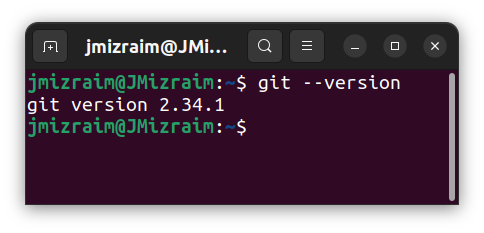
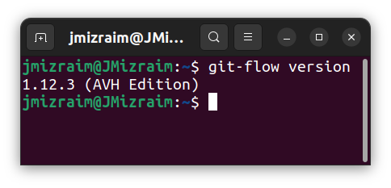
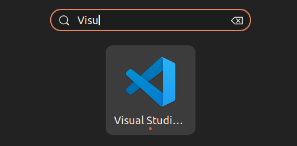
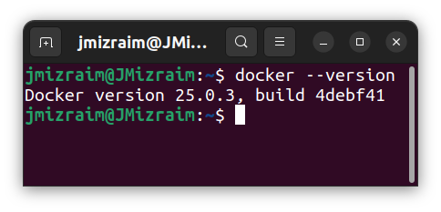
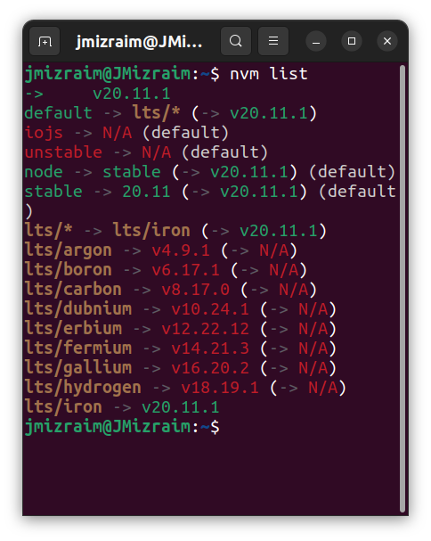
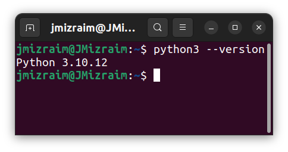
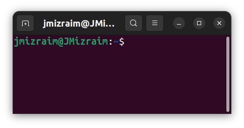
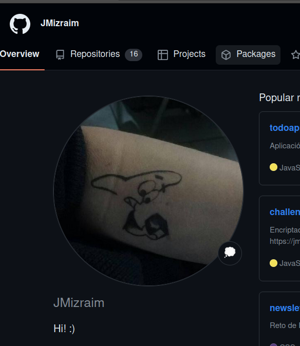
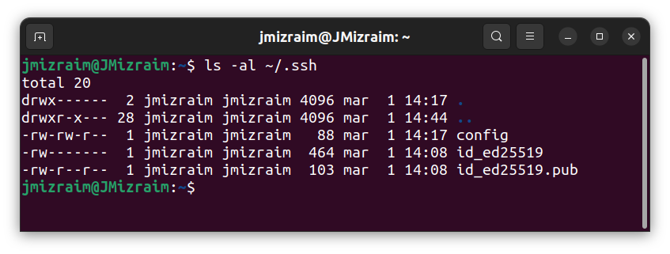

# Configuración del entorno de trabajo

## Git

## Git flow

## Editor de código

## Docker

## NVM

## Interprete de Python

## Terminal

## Instalación de navegador y plugins

## Otros

### Cuenta de GitHub

### Clave pública y privada

